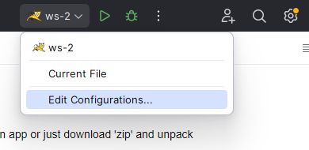
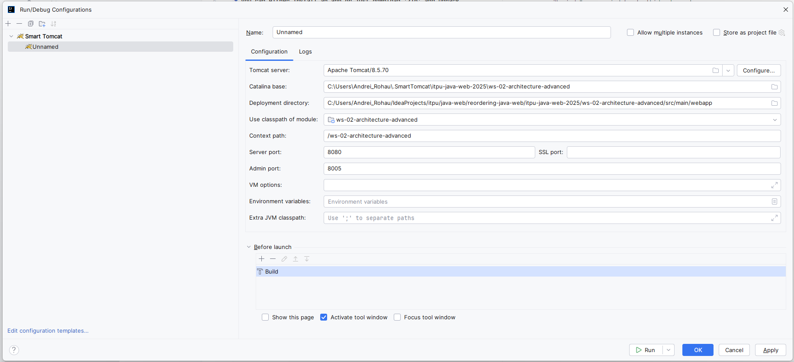

1. Install Intellij Idea

2. Install Tomcat: [link](https://tomcat.apache.org/download-10.cgi)
* you can either install an app or just download 'zip' and unpack

3. Open this repo on your local machine in Idea

4. Find smart Tomcat plugin in Intellij and install it:

5. Then open run configurations:

6. Find and add new configuration 'Smart Tomcat'

7. You would see something like 

8. Point to your Tomcat Server

9. Notice path to your app

10. Run this configuration