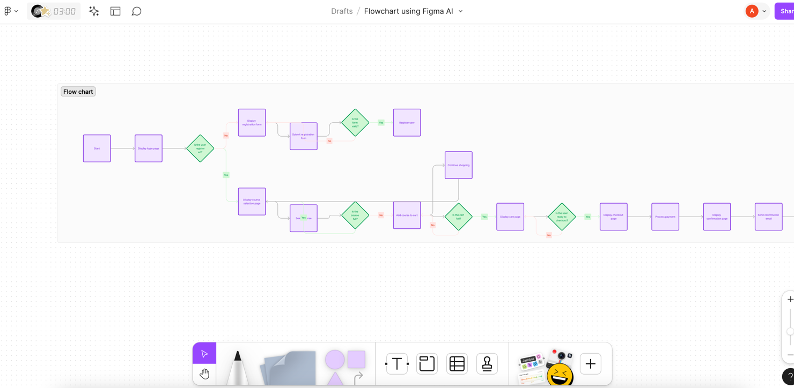

# Practicaltask format

1. Create a repository.
2. Prepare a file `README.md` and fill it with:
   - Defined purpose of your application.
   - Clarified users' objectives.
   - Identified most important elements and content for the users.
3. Develop a mockup and store it in repo as a single file (for ex.: pdf file).
4. Create an interactive prototype based on the mockup and store a link to it in `README.md`.
5. Test your prototype and implement changes.
6. Transfer your prototype to an HTML/JS version.

---

# How to quickly create mockups, prototypes, code snippets with `figma` and `builder.io`:
1. Visit [figma.com](figma.com)
2. Register and login
3. Open a `new design file`

4. Click `Assets` (left pane)

5. Search for the best suitable template and `Insert instance`

6. Prepare mockups (3 pages would be enough and does set many elements)

7. Click on `Prototype` (right pane)

8. Click on elements consequently to setup connection strategy

9. Click on `Actions` (bottom pane)

10. Search for `builder.io` pluging

11. Setup \ register \ login ...
12. Choose layer to export in an `easy` mode, and click `export`

13. Click `View Code in Builder`

14. Click on `Develop` and select: `HTML`, `CSS`, `JavaScript` and Generate Code

15. Copy generated code to into some HTML file and save changes

16. Run \ open \ execute the file and test it opens in browser

17. Snippet of the code is ready

----

